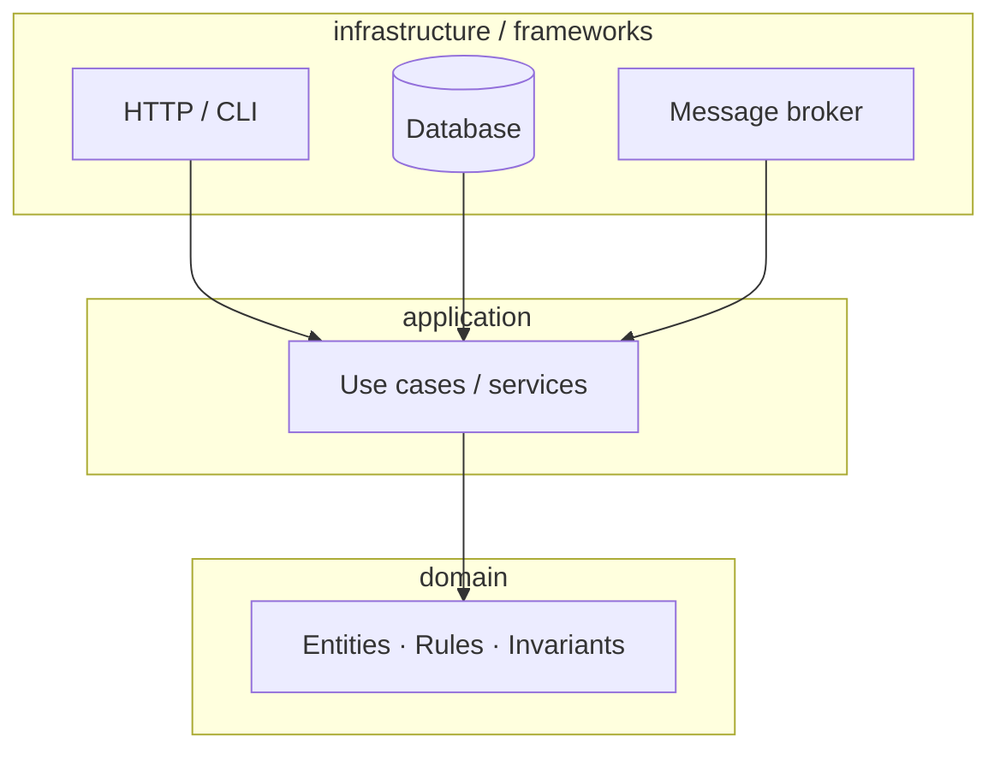

I've shipped Clean Architecture at one company, Onion at another, Hexagonal in a side project, and DDD layered for years on a national high-speed rail booking platform. Whenever someone asks "which one should we use," my honest answer is: **they're the same diagram with different labels, pick whichever one your team already speaks.**

But that answer is too cheap to be useful. Here's the longer version.

## The one rule they all share

Every diagram you've ever seen of Clean Architecture, Onion, Hexagonal, or DDD layered is saying exactly one thing:

> **The domain sits at the center. Dependencies point inward. The database, the HTTP framework, the message broker — they depend on the domain, not the other way around.**

Arrows point inward. Every style enforces this; only the labels change.

That's it. Every other rule (use ports, define entities, separate use cases, draw a hexagon) is a different way of enforcing this one constraint. The dependency rule is the invariant. The shapes and vocabulary are aesthetics.

If you understand *why* the rule matters — that domain logic outlives infrastructure choices, that you want to swap Postgres for DynamoDB without rewriting the business rules, that test-ability comes from being able to instantiate the domain without booting Spring — then the choice of style mostly stops mattering.

## What each one actually says

**Clean Architecture** (Uncle Bob, 2012) — four named concentric rings: Entities, Use Cases, Interface Adapters, Frameworks & Drivers. The dependency rule applies between rings: outer depends on inner, never the reverse. Use Cases are first-class citizens with their own layer — usually one class per use case.

**Onion Architecture** (Jeffrey Palermo, 2008) — also concentric. Domain Model at the center, then Domain Services, then Application Services, then Infrastructure / UI / Tests as the outer shell. Earlier than Clean Arch and more relaxed about the number of layers. Same dependency rule.

**Hexagonal / Ports & Adapters** (Alistair Cockburn, 2005) — drops the concentric metaphor for a hexagon to emphasize that all sides are symmetric: input and output are the same kind of boundary. The application defines **ports** (interfaces); the outside world provides **adapters** (implementations). "Driving adapters" call into the application (HTTP controllers, CLI). "Driven adapters" are called by it (DB repos, message publishers).

**DDD Layered** (Evans, 2003) — the granddaddy. Four layers: Presentation, Application, Domain, Infrastructure. Domain is the heart; the others orbit it. Same dependency rule.

## What actually differs

If you squint hard enough, the differences come down to four axes:

| | Layer count | "Use case" treatment | Symmetry of I/O | Vocabulary |
|---|---|---|---|---|
| **Clean Arch** | 4, named | Explicit layer, one class per use case | Implicit (use cases are inward) | Entity, Use Case, Interactor |
| **Onion** | 3–5, flexible | Inside Application Services | Implicit | Domain Model, Domain Service |
| **Hexagonal** | 2 (inside vs outside) | Inside the application | **Explicit** — driving vs driven adapters | Port, Adapter, Application |
| **DDD Layered** | 4, named | Inside Application layer | Implicit | Aggregate, Repository, Application Service |

Two real differences worth caring about:

1. **How explicit the I/O symmetry is.** Hexagonal is the only one that makes you stop and ask "is this a driving port or a driven port?" The others let you stay loose on that. If your system has more than one way to invoke it (HTTP + CLI + scheduled job), Hex's symmetry pays off. If it's HTTP-only, the symmetry is overhead you'll never use.

2. **How many layers are mandatory.** Clean Arch and DDD Layered push you toward four. Onion is flexible. Hex is two (inside / outside) plus whatever you decide to add inside. For most CRUD-shaped systems, four layers is two too many. For systems with deep domain rules (the rail booking engine I worked on at IBM had a fare-calculation core with dozens of business invariants), four layers is the right number.

Everything else — the shape of the diagram, whether you call it Entity or Aggregate, whether Use Cases get their own folder or live inside Application Services — is tribal vocabulary. Important for onboarding, irrelevant to the runtime.

## What I actually do

After shipping all four, what survived for me is closer to **Hexagonal in spirit, DDD-named in code**, with a flat layout until complexity demands more:

- **One module per bounded context.** Inside it, three folders: `domain/`, `app/`, `infra/`. That's the whole architecture for 80% of services.
- **Interfaces (ports) live in `app/`, not `infra/`.** The application defines what it needs from the outside; infrastructure implements. This is the single decision that makes everything else fall into place.
- **No "Use Case" classes per endpoint.** I tried it on two projects. Both times I ended up with 200 single-method classes that added zero clarity. Application services with three or four related methods stay. Use cases as a *concept* survive in code review ("what use case does this serve?"); use cases as a *class-per-thing pattern* don't.
- **Repositories are interfaces, full stop.** This is the one piece of dogma I still enforce without exception. The domain should not know what a `SELECT` is.
- **Domain stays free of framework imports.** No `@Entity`, no `BaseModel`, no `BSON.ObjectId`. The day I broke this rule on a "small" service was the day I started paying for it on every refactor.
- **Infrastructure is allowed to be ugly.** Adapters can know about everything: the framework, the domain, the wire format. They are the impedance-matchers. Don't waste effort making them pure.

For a high-domain-complexity system like the [rail booking platform](/blog/rail-ddd) or the [SUSE security product](/blog/suse-event-sourcing), I'd add: explicit aggregates, domain events as first-class types, and a separate query model when reads and writes diverge enough to hurt. That's not "more architecture" — it's the same architecture, with extra named pieces because the domain earned them.

## When the dogma costs more than it saves

The trap with all of these styles is the same: applying the full ceremony to a system whose domain is one CRUD table with a few validations.

I've reviewed code where a 200-line feature was split across 14 files: a Controller, a DTO, an Assembler, a UseCase interface, a UseCaseImpl, a DomainService interface, a DomainServiceImpl, an Entity, a Repository interface, a RepositoryImpl, two Mappers, a Specification, and a test for each. The domain rule it expressed was *"check that this string is between 3 and 50 characters."*

The dependency rule is cheap to enforce. The class-per-concept ceremony is not. If you can't name a real use case for an indirection — "we swap this repo for an in-memory one in tests," "we have two adapters for this port" — delete it. The architecture is the constraint, not the file count.

## What to actually call your team's style

In practice, after a few years on a team, the style ends up looking like: "we used Clean Arch as the original vocabulary, but we collapsed Use Cases into Application Services, we draw ports/adapters because the diagram is clearer, and we kept the DDD names for aggregates because the product people use those words."

Which is to say: a synthesis. Pick whichever style your team's existing docs lean on, enforce the dependency rule, and let the rest evolve. The argument over the name burns more team energy than the architecture itself ever does.

The diagram is a metaphor. The rule is the architecture.

---

*Next in this short series: the Clean Code parts I still believe in after 10 years — and the ones I quietly stopped following.*
