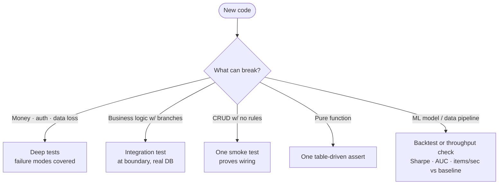

After the [last post](/blog/shipping-with-ai) the question I kept getting is the obvious one: if the model writes the feature, can it also write the tests? Technically yes. Practically, that's where most AI-assisted projects quietly rot.

Here's what I've landed on after years of shipping side projects this way, and the same patterns at the day job where I work on a catalog pipeline that processes 100M+ items/day.

## What AI defaults to (and why most of it is theater)

Ask any model to "add tests for this function" and you'll get:

- One happy-path test that calls the function and asserts the return value.
- Three edge cases that look plausible but were inferred from the function name, not from real callers.
- A mock for every dependency, including the database, the HTTP client, the logger.
- An `expect(true).toBe(true)` in a `try/finally` somewhere because the model didn't know what to assert.

Every one of those is a class of test I've watched ship green while the actual feature was broken in production. The pattern is the same across all of them: **the test was written from the same mental model as the code, so it tests that the code does what the code does. Tautological coverage.**

The version of this that bit me hardest was an integration suite where every test mocked the database. The suite was green for months. Then we did a real migration. The mocked rows didn't have the new column. The mocks didn't care. Production cared a lot. After that we made a rule that's stuck: **integration tests hit a real database, full stop**. If the fixture is annoying, fix the fixture, don't fake the dependency.

## What actually catches bugs in AI-generated code

Four things, in roughly this order of leverage:

**1. The "does this fail if I delete the function" sanity check.** Before merging any AI-written test, comment out the implementation. Did the test go red? If not, it doesn't test what you think it does. This catches the tautological tests and the always-passing ones in 30 seconds.

**2. One runnable check at the boundary, not a suite at the unit level.** For a chat endpoint, the test that matters is "I `curl` it, I get a stream back, the stream contains words." Not 14 unit tests mocking the OpenAI client. The model is great at writing the 14; only the one tells you the feature works.

**3. Type checking, then linting, then tests, in that order of cost.** TypeScript caught more AI hallucinations in this repo than any test I've written. The model invents methods, props, env-var names. The type checker rejects them immediately. Treat `tsc --noEmit` and `eslint` as your free first-pass test suite.

**4. The one console.log that proves the assumption.** From the last post: every "still not working" debugging session can be cut by 90% if you log the one thing that proves which layer is broken. This works for tests too. When a test is mysteriously red, the assert message should *name the variable that's wrong*, not just say "expected true, got false."

## What AI is genuinely good at, test-wise

- **Regression tests for a bug you just fixed.** Hand the model the diff and the failing repro, ask for a test that fails without the fix and passes with it. The model is incredibly good at this — it has both the broken and fixed state right in front of it. This is the one place I let AI write tests without much editing.
- **Boilerplate fixtures.** Setting up a test database, building a request object, seeding 50 rows with sensible defaults. Tedious for humans, instant for the model.
- **Naming.** What to call the test, what to call the describe block, what error message to use. Don't fight on these.

## Where I refuse to delegate

- **Choosing what to assert.** This is the entire test. If I let the model pick what to assert, I'm letting it grade its own homework.
- **Choosing what to mock.** Defaults to "mock everything," which is how you ship green tests around broken integrations. The rule I follow: mock the boundary of *external* trust (third-party APIs, network) and *only* that boundary. Anything inside the system runs for real.
- **Deciding whether a test is needed at all.** Trivial one-liners don't need tests. YAGNI applies to tests too. The model will write 12 tests for a 3-line function if you let it. The right test count is often zero.

## A test strategy that survives

Per-language recipes are a Google away. What's harder — and what AI is no help with — is knowing **what to test, at what level, with how much depth.** The decision tree I actually run:

Three rules underwrite it:

**1. Test at the boundary that matters, not the unit you wrote.** A handler that calls three internal services and then a DB doesn't need four unit tests with mocks; it needs *one* integration test that hits the real DB and proves the whole chain works. The most expensive bugs I've shipped live between the units, not inside them — the prod migration where mocked tests stayed green and real tables failed; the SQS retry path where every handler unit-tested fine but the visibility-timeout interaction was wrong. The rule I follow: **mock the boundary of external trust (third-party APIs, network, the clock) and only that boundary.** Anything inside the system runs for real.

**2. Risk-weight the depth; uniform coverage is a lie.** Not every line deserves the same test budget. Money paths and auth get deep tests with failure-mode coverage. CRUD-with-no-rules gets one smoke test that proves the wiring. Pure functions get one table-driven assert and move on. The mistake I keep watching teams make — and the one CI coverage badges actively encourage — is uniform coverage. 80% across the codebase looks great on a dashboard and tells you nothing about whether the parts that *can ruin your week* are tested at all. The right question isn't "what's our coverage?" — it's "if this specific path breaks, who pays?"

**3. ML and data systems are a different paradigm; don't drag web-service testing patterns over.** For [stock-advisor](https://github.com/NickChunglolz) the backtest *is* the unit test. The assertions are Sharpe, AUC, drawdown vs SPY. Writing pytest fixtures for the prediction function is missing the point — the question isn't "does the function return a float" but "does the model meaningfully beat baseline." Tests at the wrong altitude for the system you're building create the *illusion* of coverage and protect you from nothing. Same for the catalog pipeline at the day job: the test that matters is "does end-to-end throughput stay above N items/sec on a representative shard," not "does this regex function return the right groups."

The per-language part — `if __name__ == "__main__":`, `_test.go`, `*.test.ts`, JUnit, bash assert — is the easy part. Reach for whichever your project already uses, colocate it with the code, run it in one command. The decision that actually matters is **what to put inside the test, not where to put it.**

## What I'd tell someone starting

Stop asking the model "is this enough coverage." Coverage is the wrong metric — it tells you what *ran*, not what was *verified*. Ask instead:

- If this function is wrong, which of these tests will fail?
- If this dependency changes, which of these tests notices?
- If this requirement changes tomorrow, which of these tests breaks usefully and which breaks meaninglessly?

The model is now fast enough that test-writing is no longer the bottleneck. **Test-thinking still is**. The hard part of testing was never typing — it was knowing what to assert, what to leave alone, and what to refuse to mock. AI hasn't moved that needle. If anything, it's raised the stakes: the cost of a confidently-wrong test is now zero to produce and the same hours to debug.

The shortest path to quality is the same as the shortest path to anything else: do less, but make the less load-bearing.
