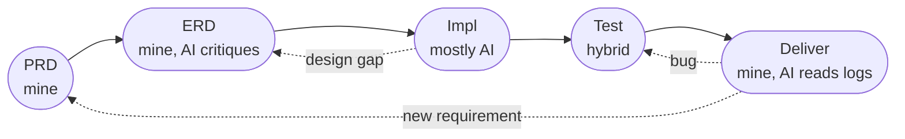

I've started a lot of projects with AI in the last year — the portfolio you're reading, a stock-advisor pipeline I'm trying to turn into something more, a CLI agent I use every day, a few work features at the day job on a catalog pipeline doing 100M+ items a day. Different stacks, different audiences, different stakes.

The thing that surprised me is how little the tools matter. The mindset transfers. The model + scaffold combo is now interchangeable enough that arguing about Next.js vs SvelteKit or LangGraph vs raw SDK is mostly noise. **What separates a project that ships well from one that drags is what you decide before AI writes a single line.**

This is what I've landed on.

## The loop, named honestly

The discipline I'm supposed to run is **PRD → ERD → impl → test → deliver**. Five stages, each with a different split between me and the model.

Here's what each one actually looks like in my work — and then the honest part, which is the stages I keep skipping.

- **PRD — only mine.** The portfolio is for a hiring manager with 90 seconds. Stock-advisor is for me first, then maybe paying users, who care whether the model actually beats SPY. The eng-agent CLI is for me when I'm context-switching between Jira tickets. AI can't write this because it can't tell me what *I'm* trying to do. The PRD doesn't have to be a doc — half the time it's three lines in the repo README. It just has to exist before any code.
- **ERD — mine, AI as critic.** Two paragraphs of approach, three risks, an explicit "not doing" list. Once it's written I paste it back into the model and ask *"what failure mode did I miss?"* This is where AI is at its best at the design stage: no political stake, no fear of looking dumb, will happily list the IAM gap or the rate-limit math I glossed over. At work this is a real ERD with reviewers; for side projects it's a markdown file in the repo. Same exercise either way.
- **Impl — mostly AI.** The portfolio went from a Vue 2 scaffold to a Next.js 16 cockpit in a weekend, mostly via diffs I reviewed but didn't write. The eng-agent's tool-routing layer is 80% generated. At $dayjob, refactors I used to put off for a quarter happen between meetings now. I read the diff, not the plan.
- **Test — hybrid.** AI is great at writing the regression test for a bug I just fixed (it has both states in front of it). It's mediocre at choosing what to assert from scratch. Whole post on this: [Quality and testing when AI writes most of the code](/blog/quality-and-testing-with-ai).
- **Deliver — mine, AI as log reader.** Push, watch the build, paste the failure trace back into the model, iterate. AI parses a 600-line Amplify build log or a stack trace faster than I can. I own the queue ("what should we ship next"); it owns the parsing.

**Now the honest part.** I skip PRD on side projects all the time. I skip ERD even more. The Amplify Secrets dance you're about to read was me skipping ERD — went from "I want Gemini chat" straight to "add a wrapper," and paid for it for a day. Almost every "wait, why doesn't this work" session this year traces back to a stage I skipped at the front. The lesson isn't *never skip*; it's that **skipping is cheap on a one-paragraph blog post and expensive on anything that touches more than one system boundary** (auth, IAM, schema, third-party API). The cost of writing a 200-word ERD is 10 minutes. The cost of skipping it on the wrong project is the rest of your day.

## PRD — start from the product, not the tool

The first instinct, mine included, is to ask the model "what stack should I use?" That's the wrong question, and the model will happily answer it — confidently, in detail, with a five-step migration plan if you push.

Before any of that, I now spend 10 minutes writing down — in the repo, not in chat — three things:

1. **Who is this for, and what do they care about?** For the portfolio: someone considering hiring me, who has 90 seconds. For stock-advisor: me, then maybe paying users later, who care about whether the model actually beats SPY. For a work feature: usually a single internal team with a known pain point.
2. **What does this need to be right about?** Three bullets, max. For the portfolio: don't leak the API key, don't commit it, don't ship broken on mobile. For stock-advisor: don't lie about backtest performance, don't ship a model worse than the baseline. For a work pipeline: don't drop data, don't break the SLO, don't make on-call worse.
3. **What's the smallest thing that proves this works?** A live URL with a working chatbot. One backtest run that beats a benchmark. One staging request that returns the right shape. Not a feature list — a proof.

That's the entire upfront cost. No architecture diagram, no library decision, no story breakdown. Once those three answers exist, the tool choice mostly picks itself, and AI is excellent at executing on it.

## ERD — sketch the smallest proof, then have AI try to break it

Even on a side project I now do a quick "ERD-lite" before any code. Half a page in the repo, seven headings:

1. **Approach.** Two paragraphs on how this will be built. "Next.js on Amplify with an SSR API route that calls Gemini; secrets via Hosting Env vars." Skip diagrams. If you can't say the approach in two paragraphs, the PRD isn't tight enough yet.
2. **Risks.** Three bullets, max. "Amplify Hosting SSR has weird env-var rules. Gemini free tier might rate-limit during launch. Mobile chrome breaks tall flexbox in old iOS." Name them so they don't surprise you in delivery.
3. **What we're not doing.** This list is more important than the approach. "No auth. No DB. No multi-user. No analytics." Future-you will try to add all of these; the explicit "not doing" list is what makes "no" easy later.
4. **Smallest proof.** Same proof from the PRD, but now described as a checkable thing. "`curl /api/chat` returns a streamed response." Concrete enough to write the test for, not yet the test itself.
5. **Test plan.** One line per layer. "Unit: provider router picks gemini when env present. Integration: real fetch to `/api/chat` returns 200 + stream. Smoke: hit prod URL after deploy, assert non-empty response." The test plan in the ERD is *what would prove this works in production*, not the test file paths — those come later. Skipping this is how you ship and then realize you never decided what "done" looks like.
6. **Open questions.** Three to five, max. "Do we cache responses? What's the rate-limit fallback — fail open or queue? Does this need an LLM cost budget alarm?" Open questions are the cheap way to surface decisions you're *deliberately deferring* — vs the expensive way, which is making the wrong call in code and finding out at delivery. At work the reviewers chew through these in the doc; for side projects, I argue both sides in the markdown and pick one.
7. **Shirt size.** S / M / L / XL, with a one-line "what makes it bigger." "M — adds an API route, no DB, no auth. L if we add usage tracking." The shirt isn't a commitment, it's a smell test: if a "small" feature keeps drifting to L during the ERD, that's the doc telling you the PRD was wrong or the approach is bloated. Catch it here, not in the impl.

Then I paste the whole thing into the AI and ask one question: *"What's a failure mode I haven't named?"* This is AI at its best — a second pair of eyes with no political stake. It'll catch the IAM gap, the rate-limit math, the cold-start latency, the migration ordering problem. Half the time it surfaces something I'd have spent a day learning the hard way.

At work the ERD is a real doc with reviewers and a sign-off; for side projects it's a single markdown file in the repo. The format doesn't matter. **Writing it before any code matters.** AI lets me skip this step, and every time I let it, I pay for it in the impl stage.

## Impl — let the model scaffold; you read diffs

After the product is clear, I let the model pick. "Take this Vue 2 scaffold and turn it into a Next.js 16 site with a chatbot in the corner." One paragraph of intent, no file list. The model is faster at picking structure than I am at writing one.

I read the diff, not the plan. If I disagree with a choice — Tailwind v4 over CSS modules, App Router over Pages, server actions over an API route — I push back inline on the diff, not on a design doc. The diff is the truth; the plan is just opinion.

This is the part that's actually 10x faster than it used to be. Routing, type checks, deploy targets, repository-pattern CRUD, the third instance of a feature flag wrapper, splitting a 400-line component into three — all of it. The kind of work I used to put off for a quarter at $dayjob now happens between meetings.

### What I delegate vs what I hold (at the impl stage)

| Delegated | Held |
|-----------|------|
| Scaffolding, refactor, fixtures, log reading, naming | Product decisions, what to assert in a test, what to mock, when "enough" is reached |
| Choosing between three sensible libraries | Choosing whether the library is even needed |
| Writing the regression test for a bug I just fixed | Choosing which bug to fix first |
| The 14-step deploy recipe | Whether I'm even on the right deploy path |

The pattern: **AI is great at execution under a clear constraint. It's mediocre at choosing the constraint.** I keep the framing; it does the typing.

## Test — covered in the next post

Whole post on this: [Quality and testing when AI writes most of the code](/blog/quality-and-testing-with-ai). Short version: AI will write you 14 plausible tests in 30 seconds, and most of them assert what the code does instead of what the requirement says. Choosing what to assert stays with you.

## Deliver — run the deploy on day one

Before the hero animation, before the chatbot, before the boot loader. At work: before the real handler, before the schema migration, before the new metrics. If the platform is going to hate you, you want it to start hating you while the surface area is small.

Once a stub is shipping, the deliver loop is: small change → push → watch the build → curl the endpoint → repeat. AI is excellent at the second half of that loop (reading build logs, parsing failure traces, suggesting the next change). It's mediocre at the first half (knowing which small change is worth shipping right now). I let it own the log reading; I own the queue.

## What AI gets confidently wrong (the part I keep underestimating)

Worth one paragraph, because the failure mode is consistent:

The model sounds most authoritative right at the edge of where its training data goes stale. Versioned platform docs (AWS, GCP, Snowflake), framework upgrades, anything where Gen 1 and Gen 2 share names. I spent the better part of a day chasing the wrong fix for an Amplify Secret because every guide I read was *almost right* — it conflated Hosting Secrets with Lambda Secrets Manager, called Environment variables "secrets" colloquially, and gave a recipe for a setup I wasn't on. Same failure mode at work: a confidently-wrong SQS visibility-timeout fix that referenced a config flag from a version we'd already upgraded past.

The fix isn't to distrust AI. It's to **always have one signal that proves which layer is broken**. The single most valuable line in the Amplify mess was `console.log("baked:", Object.keys(s).join(",") || "NONE")` — it told me in 30 seconds that the wrapper I'd rewritten three times was always fine, and the IAM grant was the actual problem. Whenever the model suggests a fix, ask: *what one log line, metric, or test would prove this is actually the layer that's broken?* If you can't answer, you're guessing.

## The mindset that crosses projects

**Lazy is context-dependent.** On a one-developer portfolio, dropping a "Secret" to an Env variable is fine — same encryption at rest, different UI surface, no shoulder-surfer. On a payment service, it isn't. The model defaults to whichever direction the docs lean and won't ask which mode you're in. That question is yours.

**Doc-sounding text is the most dangerous output.** A numbered "to fix this on AWS, do steps 1 through 5" sounds authoritative. The 90% of the time it is, you save an hour. The 10% it isn't, you lose a day. Read it with the skepticism you'd give a Stack Overflow answer from 2019.

**Platform quirks are still the long pole.** Code generation is 10x. Local iteration is 5x. Deployment debugging on managed platforms — Amplify, EKS, Dataflow, Snowflake, name your poison — maybe 1.5x. Plan around the platform pain, not the code volume.

**Ship the lazy version and question it in the same PR.** I should have shipped the plain Environment variable on day one and asked "is the Secret feature worth the dance?" Instead I built a wrapper, found the IAM gap, fixed it, found the runtime gap, fixed *that*, then realized the answer was always to delete the wrapper. The wrong question, well-engineered, is still the wrong question. This rule applies to design docs and ERDs too: the most expensive mistake is a perfectly-executed solution to a problem you didn't have.

## What I'd say to someone starting

The temptation with AI is to skip the slow upfront thinking and go straight to "type a prompt, review a PR." It feels productive. It usually isn't.

Spend the first 10 minutes on the PRD. Spend the next 20 on the ERD-lite and let AI try to break it. Spend the next 30 letting the model scaffold the entire impl. Ship a deploy before you've written the real handler. From there it's a series of one-session-per-feature loops, and the bottleneck moves from typing to deciding — which is exactly where it should be.

The model will follow whatever ambient definition of "right" the docs and the prompt collectively imply. Pinning down what *enough* looks like up front saves more time than any clever scaffold, any clever harness, any clever model.

The shortest path to a shipped project is the same as it ever was: know what you're building, build the smallest version that proves it, then iterate. AI just made every step inside that loop faster — which makes getting the loop itself wrong more expensive, not less.
